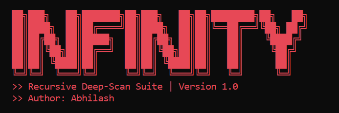

<p align="center">
  
</p>

# 🚀 Infinity Engine – Recursive Deep-Scan Suite

🔎 **Automated Web Directory & File Discovery Tool**

Infinity Engine is an adaptive, high-performance web directory and file discovery suite built for security researchers and penetration testers to dynamically map hidden web structures on-the-fly.

---

## 📌 Table of Contents

> - [Features](#-features)
> - [Installation](#-installation)
> - [Usage](#-usage)
> - [Screenshots](#-screenshots)
> - [Reports](#-reports)
> - [Technologies Used](#-technologies-used)
> - [Future Enhancements](#-future-enhancements)
> - [Disclaimer](#-legal-disclaimer)
> - [Author](#-author)
> - [Support](#-support--contribution)

---

## 🔍 Features

> 🚀 **Dynamic Lexicon Generation** – Automatically parses `robots.txt` and sweeps live HTML to harvest targeted site keywords.
> 
> 🧠 **Adaptive Merging** – Dynamically infuses external workspace dictionary lists (like `common.txt`) into active runtime memory.
> 
> 🕷️ **Recursive Scan Engine** – Implements a high-performance `deque` BFS loop to scan multi-level directories recursively.
> 
> 🛡️ **Windows Click Protection** – Programmatically disables QuickEdit Mode inside Windows CMD to prevent terminal freezes and script pausing.
> 
> ⚡ **Clean Visual Isolation** – Interactive countdown buffers and target match outputs isolated strictly in high-visibility native ANSI Red terminal formatting.
> 
> 🌐 **Cross-Platform Compatible** – Works seamlessly on Windows, macOS, and Linux.

---

## 🛠️ Installation

> ### 📥 1. Clone the Repository
> **Linux / macOS / Windows**
> ```bash
> git clone [https://github.com/shadowkons/Infinity-Scan.git](https://github.com/shadowkons/Infinity-Scan.git)
> cd Infinity-Scan
> ```
> 
> ### 📦 2. Install Dependencies
> **Linux / macOS:**
> ```bash
> pip install -r requirements.txt
> ```
> **Windows (CMD / PowerShell):**
> ```cmd
> python -m pip install -r requirements.txt
> ```

---

## 💻 Usage

> Run Infinity Engine directly from your terminal. The tool utilizes an interactive configuration prompt.
> 
> ```bash
> python infinity.py
> ```
> 
> ### 🖱️ Interactive Mode Prompts
> Upon launch, you will be guided through a configuration menu:
> - **Target URL:** Provide the base domain (e.g., `http://example.com`)
> - **Width Ceiling:** Set the path keyword character length limit.
> - **Dictionary Selection:** Use the default `common.txt` or provide a custom path.
> - **Max Depth:** Set how deep the recursive loop should branch (Default: 3).

---

## 🖼 Screenshots

> 🔴 **Infinity Engine Startup**
> *(Initializes with the signature Red ASCII logo and a 5-second countdown buffer)*
> `[Add your startup screenshot here]`
> 
> 🔴 **Live Scan & Harvesting**
> *(Displays real-time directory matching and live-crawling of unique parameters)*
> `[Add your scanning screenshot here]`

---

## 🗂 Reports

> After each successful directory discovery, Infinity Engine automatically logs findings locally to prevent data loss.
> 
> | Format | Location | Description |
> | :--- | :--- | :--- |
> | 📜 **Text Report** | `infinity_[domain]_deep_scan.txt` | Clean, plain-text format containing discovered URLs for logging and archiving. |
> 
> ### 📊 Reports Include
> - 🔗 **Discovered Paths:** Clean, formatted links to valid subdirectories.
> - 📁 **Valid File Extensions:** Confirmed file hits (`.php`, `.html`, `.js`, etc.).
> - ⏱️ **Auto-Saved Progress:** If you interrupt the scan (Ctrl+C), all findings are safely preserved in this file.

---

## 🧩 Technologies Used

> - 🐍 **Python 3.8+** – Core programming language.
> - 🌐 **Requests** – HTTP library for high-speed web requests.
> - 🥣 **BeautifulSoup4** – HTML/XML parsing for live lexicon harvesting.
> - 📊 **Tqdm** – Advanced progress bars and dynamic console outputs.
> - 🔒 **Urllib3** – Secure connection handling and SSL warning suppression.

---

## 🔮 Future Enhancements

> - ⚙️ **Multi-threading** – Parallel scanning architecture for significantly faster results.
> - 🥷 **User-Agent Randomization** – Evade basic WAFs with rotating request headers.
> - 🌍 **Proxy Support** – Route scans through external proxies.
> - 📑 **HTML Export** – Generate detailed graphical reports.

---

## ⚠ Legal Disclaimer

> 🚨 **IMPORTANT – READ BEFORE USING**
> 
> Infinity Engine is intended only for **EDUCATIONAL, ACADEMIC GROWTH, and AUTHORIZED SECURITY TESTING**.
> 
> ### ✅ Allowed Uses
> - Security testing on systems you own.
> - Authorized penetration testing with explicit written permission.
> - Educational purposes in controlled, lab environments.
> 
> ### 🚫 Prohibited Uses
> - Unauthorized scanning or testing of third-party websites.
> - Illegal hacking or unauthorized access attempts.
> - Using Infinity Engine for malicious purposes.
> 
> ### ❗ Liability Disclaimer
> The author and contributors are **NOT** responsible for:
> - ❌ Illegal usage or misuse of this tool.
> - ❌ Data loss, corruption, or system damage.
> - ❌ Legal consequences or prosecution.
> 
> 🧠 *This tool is provided "AS IS" with no warranty, express or implied.*
> 🛡 *By using Infinity Engine, you acknowledge and accept full responsibility for your actions and agree to act ethically and legally.*

---

## 👨‍💻 Author

> **Abhilash**
> - 🐙 GitHub: [shadowkons](https://github.com/shadowkons)
> - 💼 LinkedIn: `[Add Your LinkedIn Link Here]`

---

## ⭐ Support & Contribution

> If you find this project helpful:
> - ⭐ **Star the repository** – Show your appreciation!
> - 🤝 **Contribute** – Submit pull requests with improvements.
> - 🐛 **Report bugs** – Open issues for any problems found.
> 
> ### 📝 License
> This project is intended for educational use. Please see the repository for specific usage rights.

---

<p align="center">🙏 <b>Thank You for Using Infinity Engine!</b><br>Happy scanning and stay secure! 🔒</p>